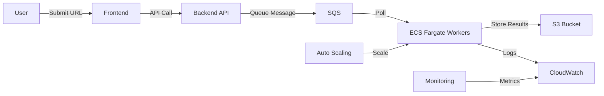

# 🌐 Distributed Web Crawler - Serverless Architecture on AWS


[](https://aws.amazon.com/serverless/)
[](https://www.python.org/downloads/)

A highly scalable, serverless distributed web crawler that processes URLs through AWS SQS queues and stores structured results in S3. Designed for enterprise-grade web scraping with built-in monitoring and auto-scaling capabilities.

## 📌 Key Features

- **Fully Serverless Architecture**: Leverages AWS managed services for minimal operational overhead
- **Elastic Scaling**: Automatically scales workers based on queue depth
- **Dockerized Workers**: Containerized scraping tasks for consistent execution
- **Persistent Storage**: All crawl results stored in S3 with structured JSON format
- **Comprehensive Monitoring**: Built-in CloudWatch logging and metrics
- **Fault-Tolerant Design**: Message queue ensures no URL is lost during processing
- **Cost-Effective**: Pay only for resources used during crawling operations

## 🏗 System Architecture



## 🛠 Technology Stack

| Component          | Technology                          |
|--------------------|-------------------------------------|
| **Frontend**       | React.js (Optional)                 |
| **Backend API**    | FastAPI (Python)                    |
| **Queue Service**  | Amazon SQS (Standard Queue)         |
| **Compute**        | AWS ECS Fargate                     |
| **Storage**        | Amazon S3 (Standard Storage)        |
| **Monitoring**     | AWS CloudWatch                      |
| **Infrastructure** | AWS CDK/Terraform (Recommended)     |
| **Scraping**       | BeautifulSoup4, Requests            |


## 🚀 Deployment Guide

### Prerequisites

1. AWS Account with admin permissions
2. AWS CLI configured (`aws configure`)
3. Docker installed
4. Python 3.10+
5. Node.js 16+ (if using frontend)

### Backend Deployment

1. **Set Environment Variables**:
   ```bash
   cp .env.example .env
   # Update values in .env
   ```

2. **Deploy API**:
   ```bash
   cd backend/
   python -m pip install -r requirements.txt
   uvicorn app.main:app --host 0.0.0.0 --port 8000
   ```

### Worker Deployment

1. **Build and Push Container**:
   ```bash
   docker build -t web-crawler .
   aws ecr get-login-password | docker login --username AWS --password-stdin <account-id>.dkr.ecr.<region>.amazonaws.com
   docker tag web-crawler:latest <account-id>.dkr.ecr.<region>.amazonaws.com/web-crawler:latest
   docker push <account-id>.dkr.ecr.<region>.amazonaws.com/web-crawler:latest
   ```

2. **Create ECS Service**:
   ```bash
   aws ecs create-service \
     --cluster web-crawler-cluster \
     --service-name web-crawler \
     --task-definition web-crawler-task \
     --desired-count 2 \
     --launch-type FARGATE \
     --network-configuration "awsvpcConfiguration={subnets=[subnet-12345],securityGroups=[sg-12345]}"
   ```

## ⚙️ Configuration

### Environment Variables

| Variable                    | Description                          | Example Value                          |
|-----------------------------|--------------------------------------|----------------------------------------|
| `AWS_REGION`                | AWS region for resources             | `us-east-1`                            |
| `WEB_CRAWLER_QUEUE_URL`     | SQS Queue URL                        | `https://sqs.us-east-1.amazonaws.com/...` |
| `WEB_CRAWLER_OUTPUT_BUCKET` | S3 Bucket for results                | `web-crawler-results-12345`            |
| `MAX_RETRIES`               | Maximum retry attempts per URL       | `3`                                    |
| `REQUEST_TIMEOUT`           | HTTP request timeout in seconds      | `10`                                   |
| `USER_AGENT`                | Custom user agent for requests       | `Mozilla/5.0 (compatible; MyCrawler)`  |

### Auto-Scaling Configuration

```json
{
  "TargetValue": 70.0,
  "PredefinedMetricSpecification": {
    "PredefinedMetricType": "SQSQueueApproximateNumberOfMessagesVisible",
    "ResourceLabel": "queue-name/web-crawler-queue"
  },
  "ScaleOutCooldown": 60,
  "ScaleInCooldown": 300
}
```

## 🧑‍💻 Development Guide

### Local Development

1. **Start Local Services**:
   ```bash
   docker-compose up -d
   ```

2. **Run Tests**:
   ```bash
   pytest backend/tests/
   pytest crawler/tests/
   ```

3. **Submit Test URL**:
   ```bash
   curl -X POST "http://localhost:8000/submit-url" \
     -H "Content-Type: application/json" \
     -d '{"url":"https://example.com"}'
   ```

### Debugging Tips

1. **View Worker Logs**:
   ```bash
   aws logs tail /ecs/web-crawler --follow
   ```

2. **Check Queue Status**:
   ```bash
   aws sqs get-queue-attributes \
     --queue-url <QUEUE_URL> \
     --attribute-names ApproximateNumberOfMessages
   ```

3. **Inspect S3 Results**:
   ```bash
   aws s3 ls s3://web-crawler-results-12345/results/
   ```

## 📈 Monitoring & Metrics

Key metrics to monitor:

1. **SQS Metrics**:
   - `ApproximateNumberOfMessagesVisible`
   - `ApproximateAgeOfOldestMessage`

2. **ECS Metrics**:
   - `CPUUtilization`
   - `MemoryUtilization`

3. **Custom Metrics**:
   - `CrawlSuccessRate`
   - `AverageProcessingTime`

Example CloudWatch Dashboard:
```bash
aws cloudwatch put-dashboard \
  --dashboard-name WebCrawler \
  --dashboard-body file://dashboard.json
```

## 🔧 Troubleshooting

| Issue                      | Solution                             |
|----------------------------|--------------------------------------|
| Messages stuck in queue    | Check worker logs, increase task count |
| High error rate            | Verify timeout settings, check target sites' robots.txt |
| Slow processing            | Review scraper logic, optimize BeautifulSoup selectors |
| Permission denied errors   | Verify IAM roles for ECS tasks       |
| Container failing to start | Check ECS task definition, verify container health checks |

## 🚧 Limitations & Known Issues

1. **Dynamic Content**: Does not execute JavaScript (consider adding headless browser support)
2. **Rate Limiting**: No built-in rate limiting (implement in future version)
3. **Duplicate URLs**: Basic URL deduplication only (hash-based)
4. **Large Files**: Not optimized for large file downloads

## 📅 Roadmap

- [ ] Add headless browser support (Playwright)
- [ ] Implement sophisticated URL deduplication
- [ ] Add rate limiting middleware
- [ ] Develop result analysis module
- [ ] Create Terraform deployment option
- [ ] Add Prometheus/Grafana monitoring

## 🤝 Contributing

1. Fork the repository
2. Create your feature branch (`git checkout -b feature/AmazingFeature`)
3. Commit your changes (`git commit -m 'Add some AmazingFeature'`)
4. Push to the branch (`git push origin feature/AmazingFeature`)
5. Open a Pull Request

